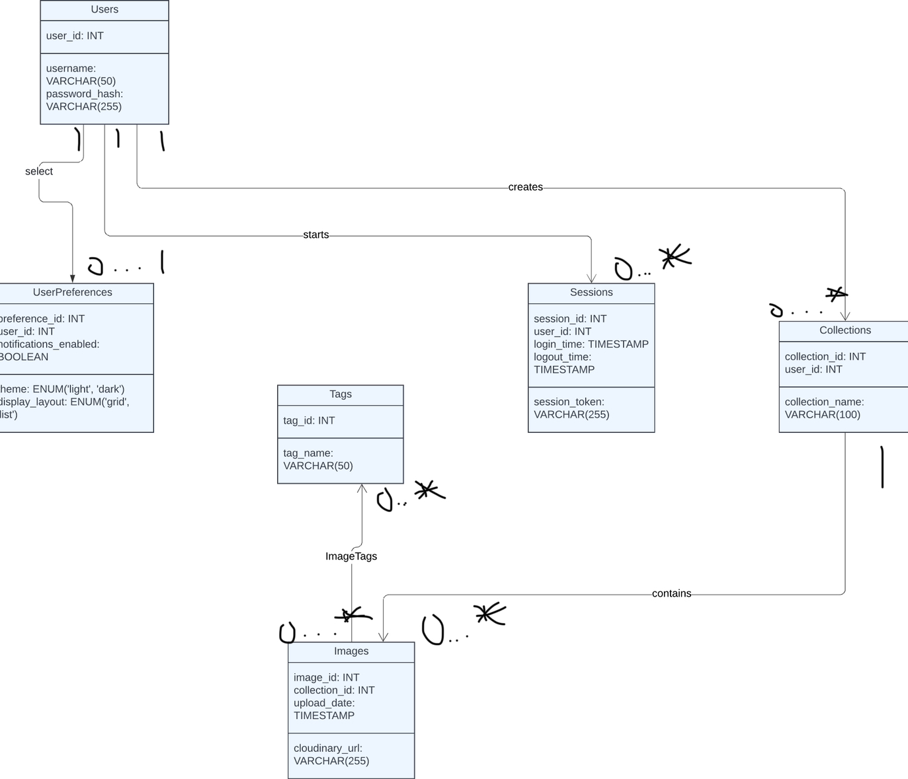
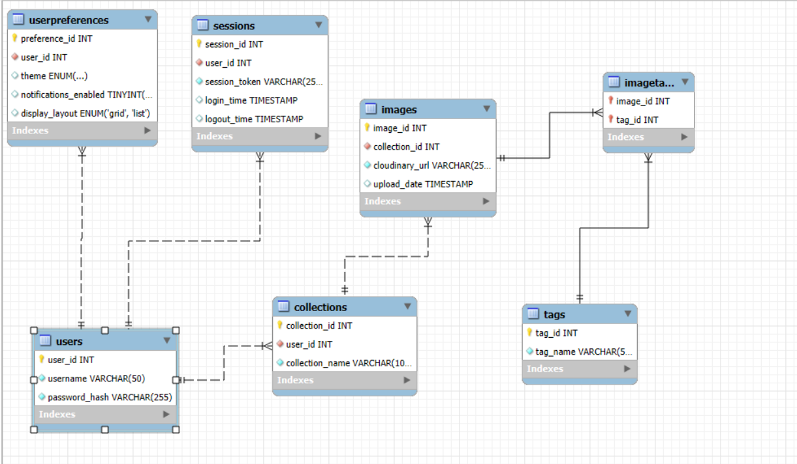
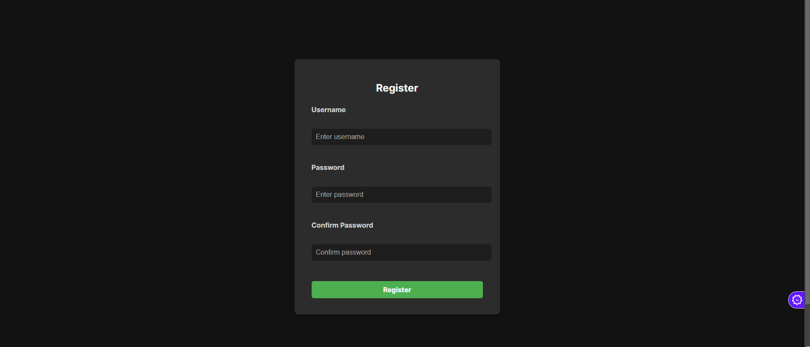
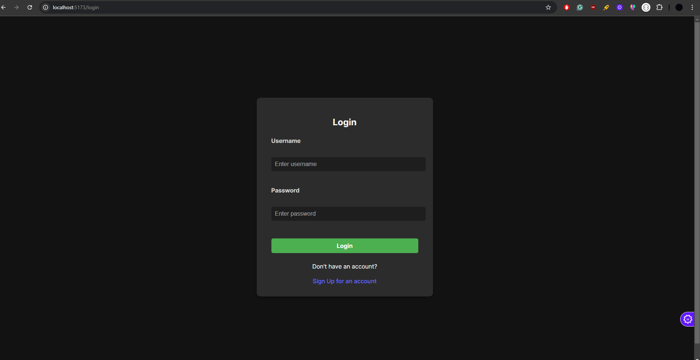
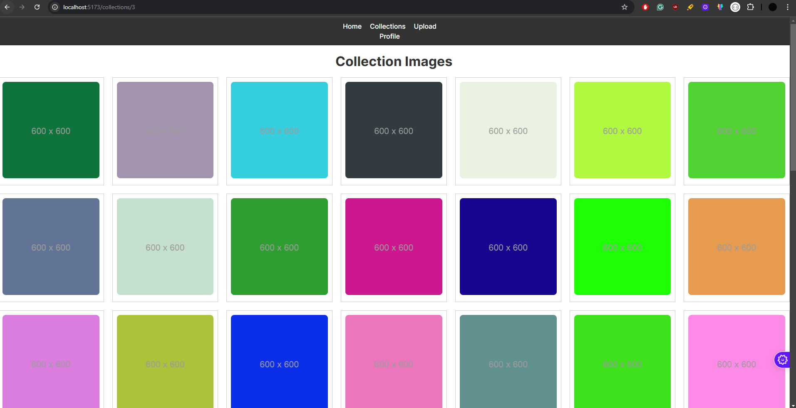
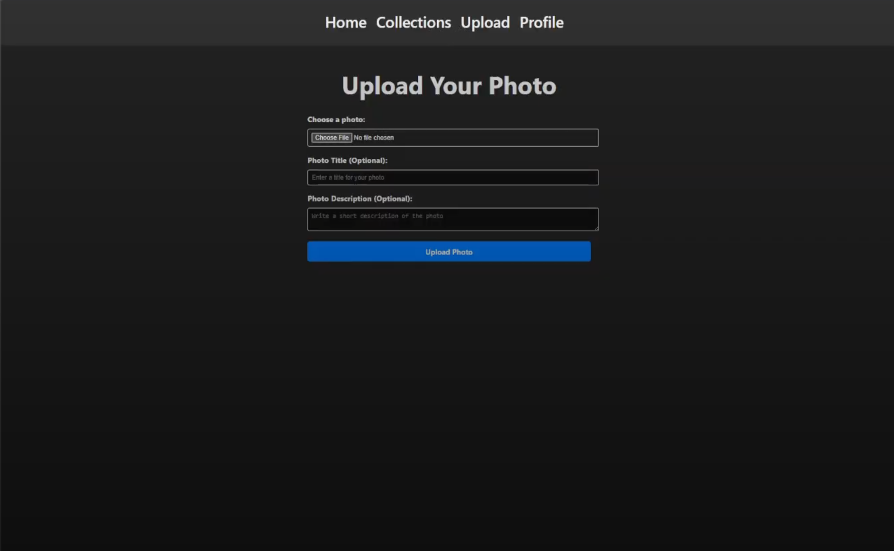
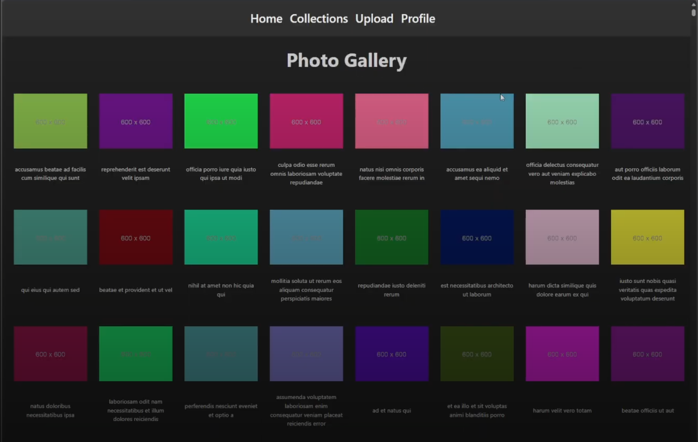

# CloudLens - Digital Photo Management Platform

## 1. Introduction

The motivation behind this project stems from the growing need for individuals to organize and showcase their digital memories effectively. In a world where photos are an integral part of storytelling, users often lack a centralized platform to efficiently manage and aesthetically display their visual content. This project seeks to address that gap by offering a system that combines robust organization tools with an appealing visual interface, tailored for both casual users and photography enthusiasts.

From a technical perspective, the platform integrates modern web technologies to create a scalable, responsive, and user-friendly experience. By leveraging a **React.js frontend** for dynamic user interactions and an **Express.js backend** for seamless API handling, the system ensures optimal performance and reliability. A **relational database (MySQL/PostgreSQL)** is employed for structured data storage, ensuring consistency and quick retrieval of user and photo data. Additionally, **Cloudinary** is integrated to manage image uploads and hosting, guaranteeing efficient delivery and storage of large media files.

### Target Audience

The primary users of this platform include:
- Individuals looking to preserve personal memories in an organized, digital format.
- Photographers and creative professionals who need a space to display their collections.
- Anyone seeking a simple yet visually appealing solution for managing and showcasing photos online.

This project embodies the idea of bridging utility with design, offering users an intuitive interface for cataloging their memories while ensuring the backend remains robust, scalable, and secure.

---

## 2. Design

### System Design Overview
The platform employs:
- **React.js** frontend for user interactions.
- **Express.js** backend for API handling.
- **MySQL** database for structured data storage.
- **Cloudinary** for efficient image hosting.

The design emphasizes modularity, scalability, and user-centric interactions.

### UML Diagram
The UML diagrams include:
- User Authentication Flow (register, login).
- CRUD operations for Collections and Photos (create, read, update, delete).

### Entity-Relationship Diagram (ERD)

Below is the ERD representing key entities and their relationships:

- **Users**: Stores user details (user_id, username, password_hash).
- **Collections**: Contains user-specific collections (collection_id, user_id, collection_name).
- **Photos**: Includes details of images within collections (photo_id, collection_id, photo_url, title, description).

---

## 3. Implementation

### Frontend Implementation
- **Technology Stack**: Developed using React.js for a modular, component-based architecture.
- **Routing and Navigation**: Utilizes React Router for SPA navigation.
- **Dynamic Content Rendering**: Fetches and displays images dynamically using Axios.
- **Form Handling**: UploadForm handles client-side validation before sending data to the backend.

### Backend Implementation
- **Technology Stack**: Built using Node.js and Express.js.
- **API Design**: RESTful APIs handle operations like creating collections, uploading photos, and user data retrieval.
- **Authentication**: Implements JWT (JSON Web Tokens) for secure user authentication.
- **Error Handling**: Provides meaningful error messages for validation failures.

### Database Implementation
- **Schema Design**: Uses MySQL with relational integrity for structured data storage.
- **Queries**: Secure, parameterized queries prevent SQL injection.
- **ER Diagram**: Users → Collections → Photos relationship ensures secure, user-specific data access.

### Cloudinary Integration
- **Media Handling**: Efficient image uploads and web-optimized delivery.
- **Scalability**: Supports large-scale image storage without server limitations.

---

## 4. Testing and Debugging
- **Manual Testing**: API endpoints verified using Postman.
- **Frontend Testing**: Components tested in isolation for functionality.
- **Database Debugging**: Queries verified in a MySQL shell.

---

## 5. Functionality

The system provides the following capabilities:
- **User Authentication**: Secure registration and login using hashed passwords and JWT tokens.
    
    
    

- **Collection Management**: Create, view, update, and delete collections.
    
- **Photo Management**: Upload images to collections with optional titles and descriptions.
    
- **Dynamic Gallery**: Aesthetic display of collections and photos.
    
- **Responsive Design**: Optimized for desktop and mobile devices.

---

## 6. User Manual

### How to Use the Platform:
1. **Registration**:
   - Navigate to the registration page.
   - Enter a unique username and password.
   - Click the "Register" button.

2. **Login**:
   - Use your credentials to log in.
   - If successful, you'll be redirected to the homepage.

3. **Create Collections**:
   - Click on the "Collections" tab in the navbar.
   - Use the "Add New Collection" button, provide a name, and save it.

4. **Upload Photos**:
   - Navigate to the upload page.
   - Select a collection, upload an image, and add optional metadata (title/description).

5. **View Photos**:
   - Go to any collection to see all associated photos.
   - Click on a photo for detailed view.

---

## 7. Conclusion

This project showcases the integration of modern web technologies with thoughtful design and efficient implementation to deliver a robust platform for managing and displaying personal visual memories. 

Key highlights:
- **React.js** for a responsive, modular frontend.
- **Express.js** and **MySQL** for a scalable, secure backend.
- **Cloudinary** for efficient media storage and delivery.
- **JWT Authentication** for secure user interactions.

The platform provides a scalable foundation for future enhancements, including social sharing, tagging, and collaborative collections.

---

## 8. Contribution of Group Members

- **Toluwanimi Ayodele**: Backend/Frontend Engineer
- **Joseph Egbuanran**: Frontend Engineer, UI/UX Design
- **Kayla Fkanigan**: Database Design/Architect
- **Samuel Coker**: UI Design
- **Alhaji Kargbo**: Backend Design

---

## 9. Demo and Resources

- **CloudLens Demo**: [Download Demo](https://drive.google.com/file/d/1X8OFieJZjstZyHVyabVdv1dODc6RVv35/view?usp=sharing)
